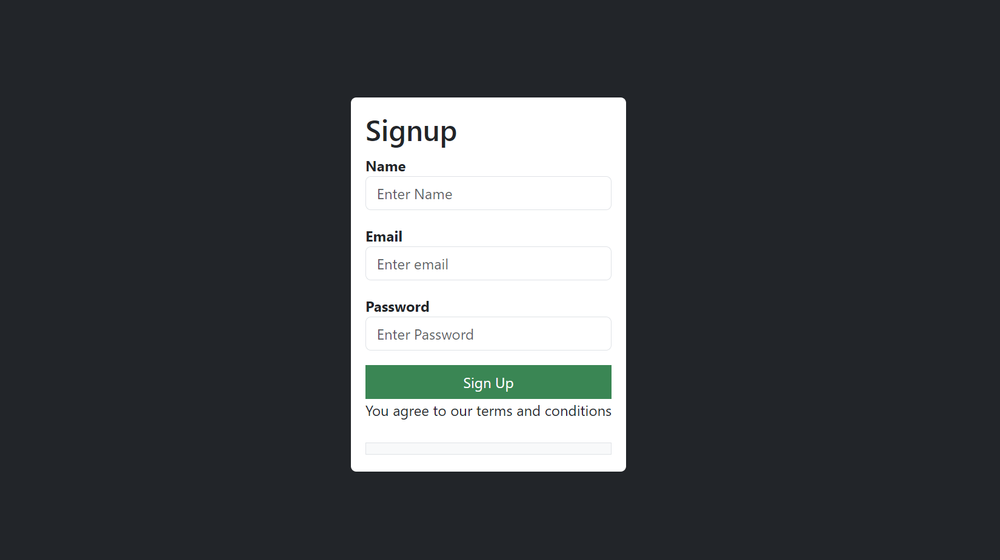

# SIGNUP PAGE

This code was done using React, Express.js, Node.js and Mysql.

Below is a picture of the signup page



Before you start the front end you'll need to have npm,node and javascript installed. You'll also need to install certain dependencies using the command below

```bash
npm install
```

To run the script you'll use the command below

```
npm start
```

To run the backend

```
npm install
npm start
```
